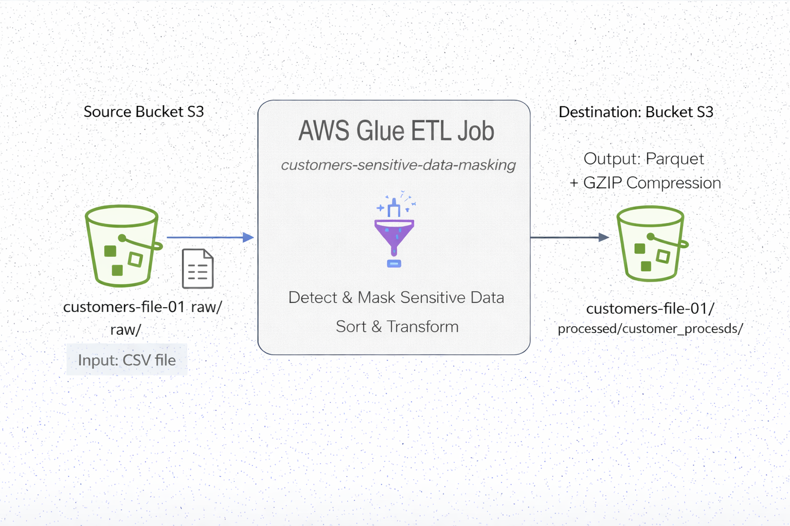
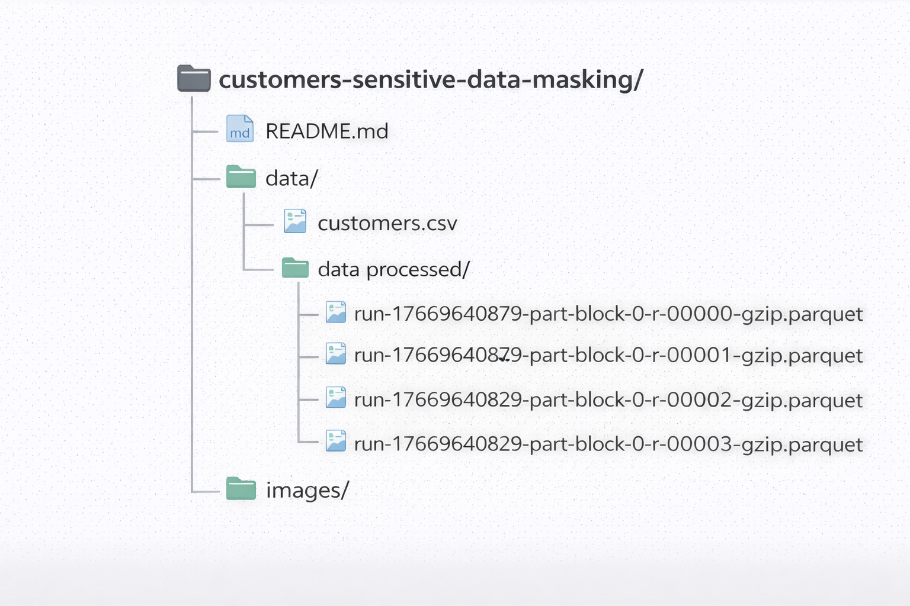
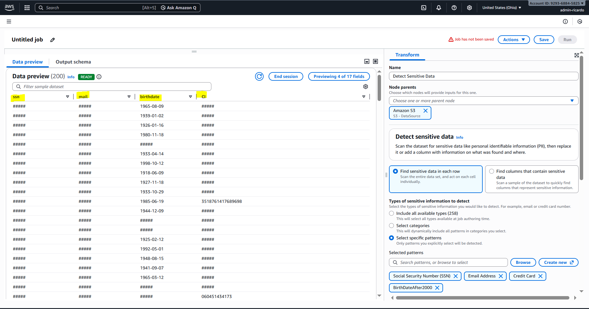
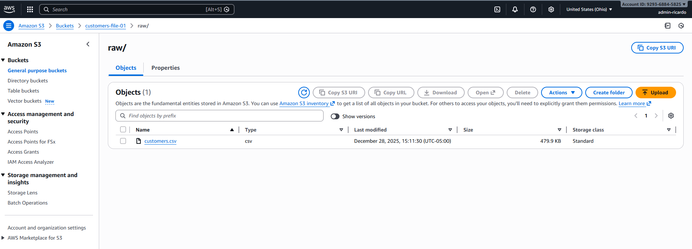
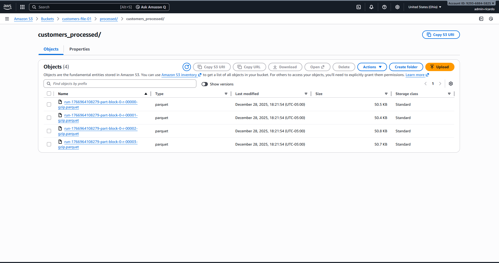

# Customers Sensitive Data Masking – AWS Glue ETL

## Sensitive Data Detection and Masking

This project demonstrates an end-to-end **AWS Glue ETL pipeline** designed to detect, mask, and transform sensitive customer data stored in Amazon S3.  
The solution focuses on **data privacy**, **PII protection**, and **modern data lake best practices** using AWS-native services.

---

## 📌 Project Overview

The ETL job processes a raw CSV file containing customer information and applies the following transformations:

- Detects **sensitive data (PII)**:
  - Social Security Number (SSN)
  - Email address
  - Credit card number
  - Birth dates after the year 2000 (custom pattern)
- Masks detected sensitive values using `#####`
- Sorts records alphabetically by `username`
- Writes the cleaned data back to Amazon S3 in **Parquet format with GZIP compression**

---

## 🏗 Architecture

The pipeline follows a simple and scalable architecture:

- **Source**: Amazon S3 (CSV file)
- **Processing**: AWS Glue Visual ETL Job
- **Destination**: Amazon S3 (Parquet + GZIP)

---

## 📂 Project Structure

The repository is organized as follows:

---

## 🔄 ETL Workflow

1. **Raw Data Ingestion**
   - Input file: `customers.csv`
   - Source zone: Amazon S3 raw bucket

2. **Sensitive Data Detection**
   - AWS Glue built-in and custom detection patterns
   - Row-level scanning for PII
   - Masking applied directly during transformation

3. **Data Transformation**
   - Sensitive values replaced with `#####`
   - Records sorted by `username`

4. **Processed Data Output**
   - Format: **Parquet**
   - Compression: **GZIP**
   - Destination: Amazon S3 processed bucket

---

## 🖼 Visual Evidence

### Sensitive Data Detection

### Raw Input Data

### Processed Output Data

---

## 🔐 Data Privacy & Security

- Sensitive fields are **never exposed in the output**
- Masking is applied consistently across all detected patterns
- The solution follows **privacy-by-design principles**

---

## 🛠 Technologies Used

- AWS Glue (Visual ETL)
- Amazon S3
- Apache Parquet
- GZIP Compression
- AWS IAM

---

## 🚀 How to Run

1. Upload `customers.csv` to the S3 raw bucket
2. Configure the AWS Glue Visual ETL job
3. Run the job from AWS Glue Studio
4. Validate the Parquet output in the processed S3 path

---

## 📈 Key Takeaways

- Real-world handling of **PII in data pipelines**
- Serverless ETL using AWS Glue
- Optimized storage using Parquet and compression
- Clear separation between raw and processed data zones

---

## 👤 Author

**Ricardo Alfonso**  
Data Engineering | AWS | Cloud ETL
